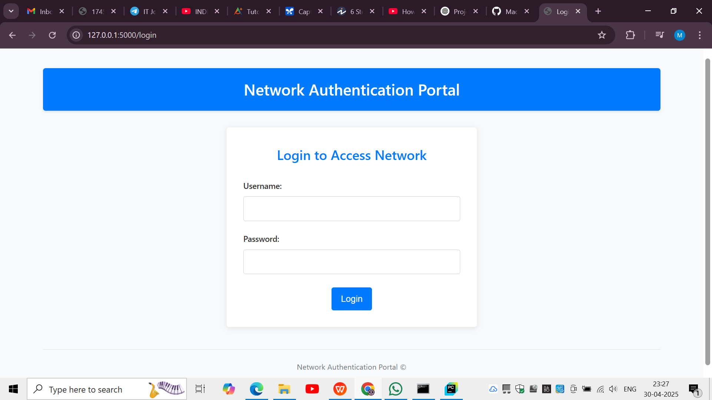
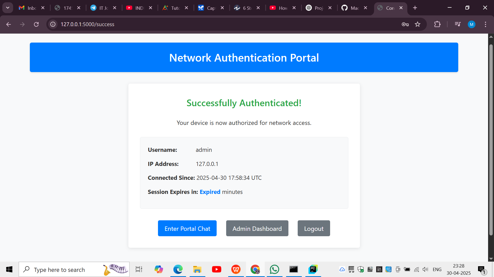
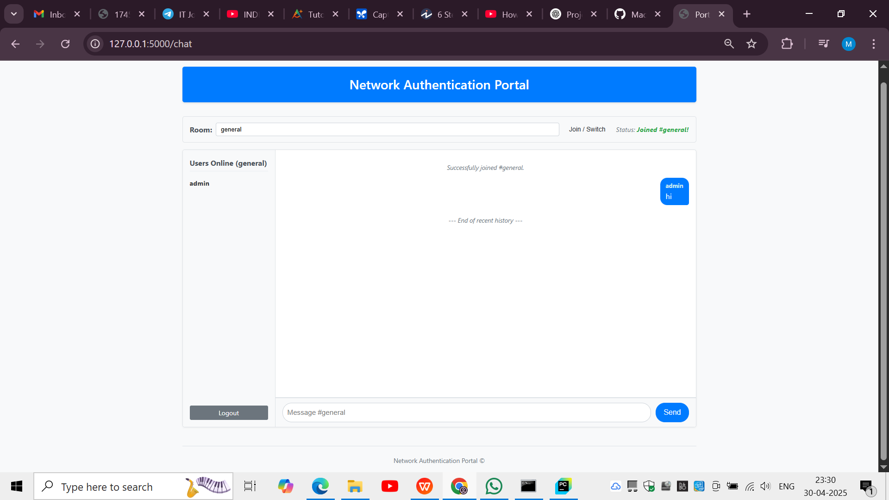
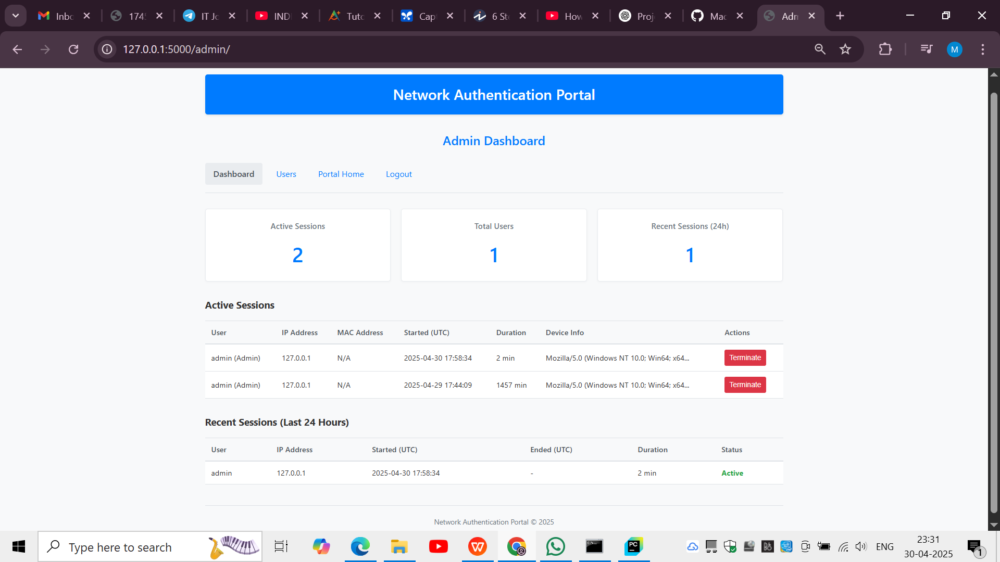
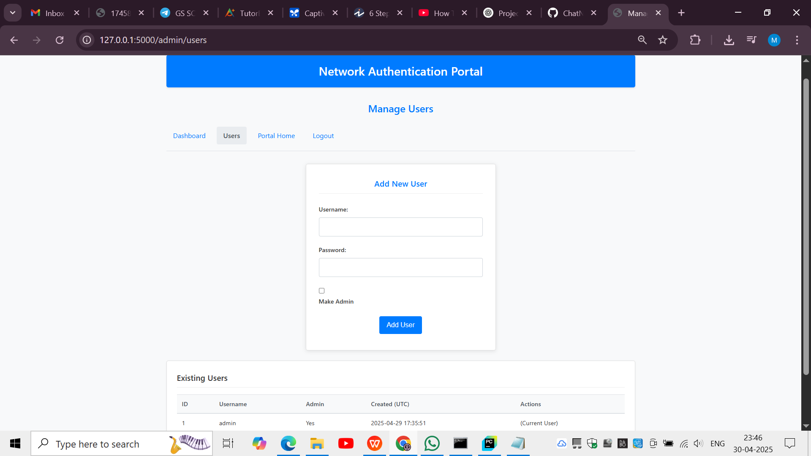

# 🔐 NetGate Chat – A Network Authentication Portal with Real-Time Chat

Welcome to **NetGate Chat**, a full-stack project that simulates a **captive portal** environment where users must authenticate before gaining access to a **real-time chat system**. This combines **Computer Networking principles**, **Web Development**, and **Real-Time Communication** into one cohesive solution.

---

## 🌐 Project Screenshots

### 🔐 Login Page
Users must authenticate before accessing the network.


### ✅ Authentication Success
Displays user info after successful login, with access to chat and dashboard.


### 💬 Chat Room (Real-Time)
Authenticated users can chat live using WebSockets.


### 🧑‍💼 Admin Dashboard
Admins can monitor, control, and terminate active sessions.


### 👥 Manage Users Page
Admins can create new users, promote them to admin, or view existing users.  

---

## 🧩 Key Features

- 🔐 Captive Portal-like login system
- 👤 User authentication with Flask-Login
- 💬 Real-time chat using Flask-SocketIO and WebSockets
- 📊 Admin dashboard showing live session data
- 🧠 IP address, MAC (simulated), browser agent logging
- 🛑 Session timeout and manual termination
- ⚙️ Simulated firewall control using `network_controller.py`

---

## 🧠 Computer Networking Concepts Used

- **Client-Server Architecture**
- **IP Addressing & Access Control**
- **HTTP Protocol**
- **WebSockets (Real-Time Communication)**
- **MAC Address Logging (via ARP lookup)**
- **Session Management**
- **Firewall/ACL Simulation**
- **DHCP/DNS Context Understanding**

---

## 🔧 Technologies Used

| Area            | Technology                          |
|-----------------|--------------------------------------|
| Language        | Python                               |
| Backend         | Flask, Flask-Login, Flask-SocketIO   |
| Real-Time Comm  | Socket.IO, Gevent                    |
| Database        | SQLite, Flask-SQLAlchemy ORM         |
| Frontend        | HTML, CSS, JavaScript (Vanilla)      |
| Session Mgmt    | Secure Cookies, Flask-Login          |
| Styling         | Custom CSS                           |

---

## 📁 Project Structure

```
network_auth_portal/
├── app.py                  # Flask main app
├── config.py               # Configuration settings
├── network_controller.py   # Simulated IP firewall logic
├── templates/              # Jinja2 HTML templates
├── static/                 # CSS & JS files
├── portal.db               # SQLite database
├── requirements.txt        # Python dependencies
├── README.md               # This file
```

---

## 🚀 Setup Instructions

Follow these steps to run the project locally:

1. **Clone the repository**
   ```bash
   git clone https://github.com/yourusername/network_auth_portal.git
   cd network_auth_portal
   ```

2. **Create virtual environment**
   ```bash
   python -m venv venv
   venv\Scripts\activate  # On Linux/Mac: source venv/bin/activate
   ```

3. **Install dependencies**
   ```bash
   pip install -r requirements.txt
   ```

4. **Run the Flask app**
   ```bash
   python app.py
   ```

5. **Access in browser**
   ```
   http://127.0.0.1:5000/login
   ```

---

## 💡 Ideas for Future Enhancements

- Real firewall integration (e.g., using `iptables`)
- User registration system
- Admin role-based access controls
- Chat room creation and moderation
- Export session logs to CSV or PDF
- Responsive UI for mobile

---

## 🙋 About the Developer

**Madhumitha R Amalkar**  
📧 Email: [mitha0179@gmail.com](mitha0179@gmail.com)

---

## 📜 License

This project is licensed under the [MIT License](LICENSE).

---


 
